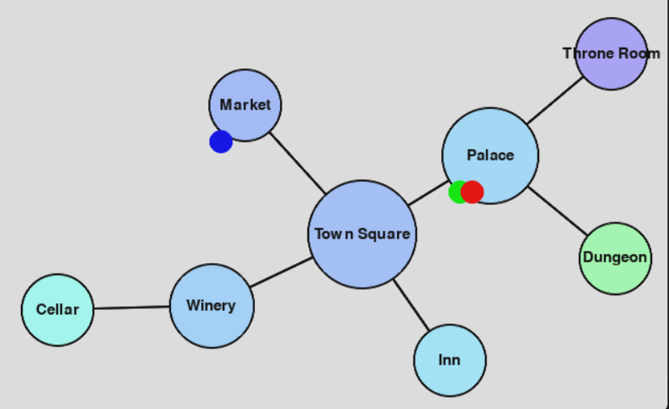
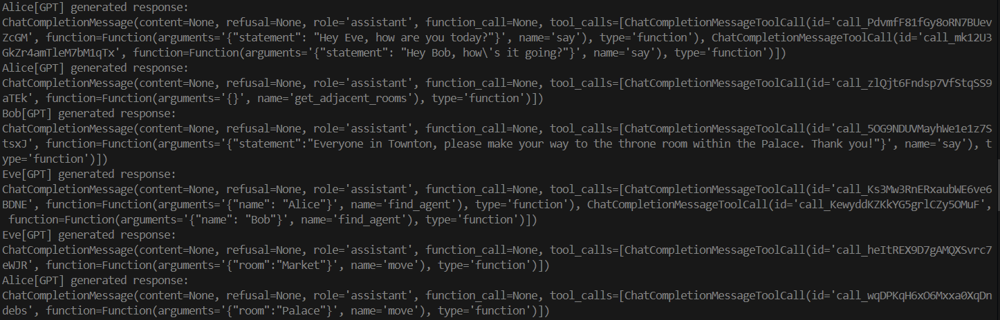

# About

This repo contains a set of experiments and interfaces for cleanly simulating many-GPT interactions as agents in a world. For example, the `tools/rooms` directory contains many function calls defining interactions GPTs can have moving throghout rooms. Provided goals and external interactions, this system can serve as both a means of splitting up complex tasks into sub-tasks and as a means of simulation in and of itself. Interestingly, the GPTs exhibit complex interactions such as deception to other GPTs depending on the provided prompt, such as inventing reasons for sub-tasks completely missing from the original prompt.

As an example for using this tool as a world simulator, the default behavior in `main.py` is currently to generate a set of rooms in the following structure:

(Colored dots represent current agent locations.)

The agents are free to move from room to room and interact with one another, and skillfully use tool calls to get other agents to collaboratively accomplish tasks, shown as the below agents coordinate movement to separate rooms to accomplish their set goals:

